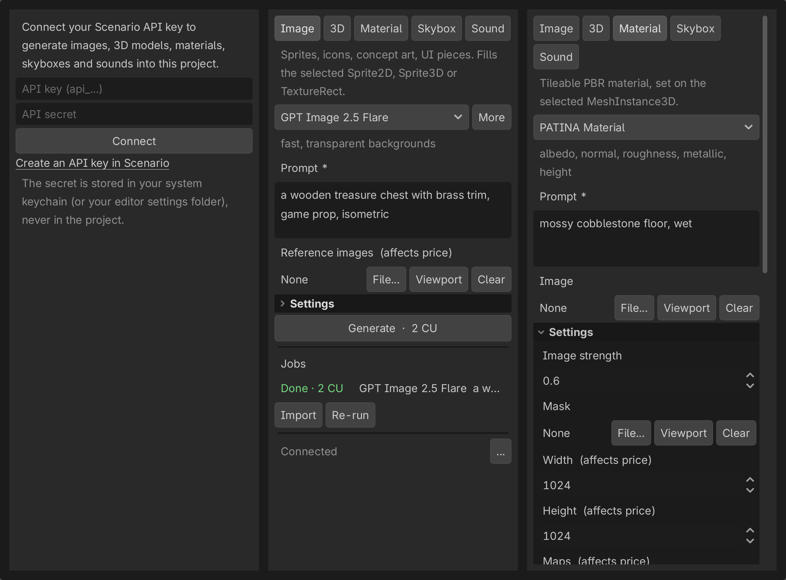

# Scenario for Godot

Generate images, 3D models, PBR materials, skyboxes and sound effects with [Scenario](https://scenario.com) from a dock inside the Godot editor. You see the exact price in Creative Units (CU) before you spend, and the result lands in the open scene as a native Godot asset.



**Version 0.1.1.** Tested on Godot 4.7.2 (standard build, macOS). GDScript only, so it also loads in the .NET build. MIT license.

## Install

1. Download `scenario-godot-plugin-0.1.1.zip` from the releases page, or copy `addons/scenario/` from this repository.
2. Unzip it at the root of your Godot project, so you get `res://addons/scenario/plugin.cfg`.
3. In Godot, open **Project > Project Settings > Plugins** and enable **Scenario**. The Scenario dock opens in its own column, right of the Inspector.

## Sign in

Create an API key and secret in the Scenario web app ([app.scenario.com](https://app.scenario.com)), then paste both into the dock and press **Connect**.

The secret never goes into your project folder, so it cannot end up in git:

- macOS: the secret is stored in your login Keychain (service "Scenario Godot Plugin"). Only the key id is written to the editor settings folder.
- Other systems: key and secret are written to `scenario/credentials.json` in the Godot editor settings folder, readable by your user only.
- `SCENARIO_API_KEY` and `SCENARIO_API_SECRET` environment variables take precedence over both, which suits CI and shared machines.

Generations are billed to the Scenario project that owns the key.

## Lanes

| Lane | Default model | Other models in the picker | Lands in the scene as |
|---|---|---|---|
| Image | GPT Image 2.5 Flare | GPT Image 2.5 Sunburst, Gemini 3.1, Seedream 5.0 Pro | the texture of the selected Sprite2D, Sprite3D, TextureRect, TextureButton or Decal; with nothing selected, a new Sprite3D (1 m tall), Sprite2D or TextureRect to match the scene |
| 3D | Rodin Gen-2.5 (text to 3D, PBR) | from text: Meshy 7.1, Tripo P2; from an image: Hunyuan 3D 3.1 Pro, Tripo 3.1, Meshy 7.1, Hitem3D 3.0 | the imported GLB, instanced under the selected Node3D, or 4 m in front of the editor camera |
| Material | PATINA Material | Scenario Texture | a `StandardMaterial3D` (albedo, normal, roughness, metallic, height) saved as `.tres` and set as `material_override` on the selected meshes; with no mesh selected, just saved |
| Skybox | Scenario Skybox GPT | Scenario Skybox Flux | a `PanoramaSkyMaterial` sky on the scene's WorldEnvironment (created if missing) |
| Sound | Sonilo V1.1 SFX | ElevenLabs Sound Effects 2, MM Audio 2 | a new AudioStreamPlayer3D, AudioStreamPlayer2D or AudioStreamPlayer to match the scene |

**More** (Image, 3D and Sound lanes) adds Scenario's recommendations for your prompt to the picker. The form is built from each model's live schema; settings that change the price are marked "affects price".

Prices measured on 2026-10-04, as examples: Flare at low quality 1024x1024, 2 CU; Rodin Extreme-Low PBR, 80 CU; PATINA 512x512, 6 CU; Skybox GPT at low quality, 2 CU; Sonilo 2 s, 1 CU. Scenario sets the prices; the dock always shows the current one.

## Spending rules

- **Price first.** Every change to the form triggers a free price check; the button reads `Generate  ·  N CU`. Generate stays disabled until the price matches the form as it is now.
- **One click, one paid request.** Each price is used once. A paid request is never retried automatically.
- **Uncertain means Unknown.** If the connection drops while a request is being sent, the job is marked **Unknown** and the same request is blocked until you press **Check Scenario**, so a network glitch cannot charge you twice.
- **Confirmation above a threshold.** Requests above 100 CU ask first (Editor Settings > Scenario > Confirm Above CU).
- **Spending switch.** Launch Godot with `SCENARIO_NO_SPEND=1` and every paid request (and every upload) is refused before it leaves the editor. Price checks, cancels and imports still work.
- **Blocked** jobs (moderation) are shown as such and never resent.

## Where files go

Results are saved under `res://scenario/<lane>/`, named `<date>-<prompt>-<asset>[-<map>].<ext>`, for example `res://scenario/material/2026-10-04-mossy-cobblestone-floor-p2mgtx-normal.png`. Normal maps are imported as normal maps. Next to each result, a `.scenario.json` file records the job, model, prompt, parameters and CU charged, so you can trace every asset back to its generation.

The job list lives in `res://.godot/scenario/jobs.json`. It survives editor restarts and stays on your machine (`.godot/` is not committed).

Every placement is one undo step (Ctrl+Z, Cmd+Z on macOS).

## Documentation

- [User guide](docs/USER_GUIDE.md): each lane step by step, references, job states, troubleshooting.
- [Changelog](CHANGELOG.md), [known issues](BUGS.md), [roadmap](ROADMAP.md).
- [llms.txt](llms.txt): a map of the code for coding agents.

## Development

The repository root is a small Godot demo project that hosts the addon and its tests. Requirements: Godot 4.7 on the PATH as `godot`, Python 3, and the godot-expert toolkit used by the test runners (`GODOT_EXPERT_SCRIPTS` points to its `scripts/` folder).

```sh
make test     # unit tests (GUT, 85) and the headless editor test (69 checks, fake backend, 0 CU)
make zip      # dist/scenario-godot-plugin-<version>.zip, then a clean install into a blank project
make dock     # re-render docs/images/dock-<version>.png (fake backend, opens a small window)
```

With `SCENARIO_API_KEY` and `SCENARIO_API_SECRET` set:

```sh
python3 tools/contract_check.py      # free: every listed model loads and prices, no-spend switch holds
python3 tools/live_acceptance.py     # PAID: one run per lane, ledger in tests/live/LEDGER.md
```

## License

MIT, see [LICENSE](LICENSE).
