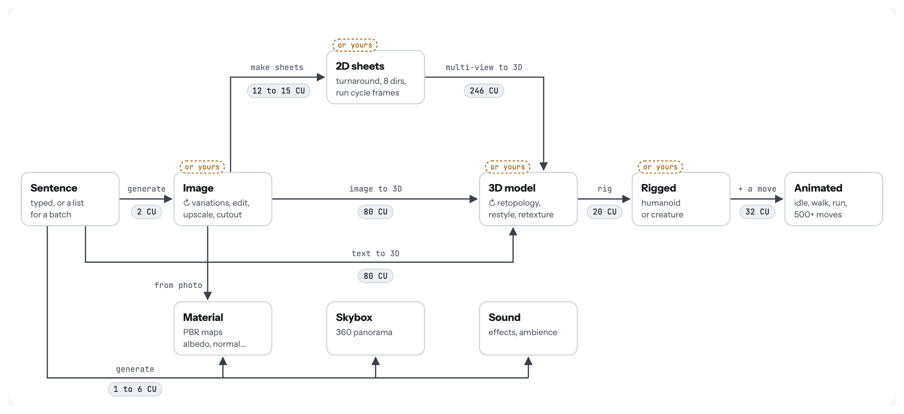

# Steps on any asset

Status: proposal for 0.2 and later (2026-10-04). Nothing here is built yet. Prices come from free Scenario price checks (`dry_run`) on 2026-10-04 and can change.

## The idea

In 0.1 you pick a lane, pick a model, fill a form, and get one file plus a node. From 0.2 the plugin is built from two things:

- **assets**: anything in the project or in Scenario, such as a sentence, an image, a sprite sheet, a GLB, a rigged character, a clip, a material or a sound;
- **steps**: each one turns one kind of asset into another.

Any asset can go through any step that accepts its type, whether Scenario made it or you did. You decide where to start, which steps to take, which model runs each step, and where to stop.

On the map, a dashed "or yours" tag marks a box that also accepts your own file (from Blender, Aseprite, a photo). ↻ marks steps that keep the asset's type.

## What the user can do

1. **Start anywhere**: a sentence, your own sketch, a GLB from Blender or the Asset Library, a node already in the scene, a folder.
2. **Stop anywhere**, at the finish level chosen for the run:
   - a file;
   - a Godot resource;
   - a node placed in the open scene;
   - a playable result.
3. **Change the path**: skip a step, swap the model of any step (the price updates), use your team's trained models or Scenario workflows as steps.
4. **Hand off to yourself**: open any intermediate result in Blender, Aseprite or Krita, fix it, save, and continue from your version.
5. **One or many**: run the same steps over a folder of props, or over every item resource that has no icon, priced once for the batch.
6. **Any driver**: the dock, a right-click, a "Make me…" sentence, a GDScript call from a tool script or CI, or a coding agent calling the same steps.

## What stays fixed

- **Spending rules.** The rules in the README apply to every run, whatever its length:
  - the price is shown before anything runs;
  - each step uses a single-use price check;
  - a paid step is never retried;
  - there is a spending cap per run;
  - confirmation is required above the threshold.
- **Nothing is overwritten.** Each step writes a new version next to the previous one, and the asset's history (source, model, prompt) is kept in its `.scenario.json`. Placement goes through the editor's undo.
- **One set of steps.** The dock, "Make me…", batches and scripts all call the same steps, so a path that works in one works in all.

## Steps

| From | Steps | To | Price (2026-10-04) |
|---|---|---|---|
| Sentence | generate an image, a 3D model, a material, a skybox, a sound (the 0.1 lanes) | image, 3D model, material, skybox, sound | image 2 CU; text to 3D 80 CU (Rodin 2.5); material 6 CU; skybox 2 CU; sound 1 CU |
| Image | variations, edit, remove background, upscale, restyle, pixel cleanup | image | from the price check |
| Image | 8 directions, run cycle sheet, turnaround | 2D sheets | 12 CU, 15 CU (Scenario workflows) |
| Image | image to 3D | 3D model | 80 CU (Rodin 2.5) |
| 2D sheets | multi-view to 3D | 3D model | 246 CU (Concept to 3D workflow) |
| Image | photo to PBR | material | from the price check |
| 3D model | retopology, restyle, retexture | 3D model | retopology 15 CU, restyle 30 CU (Tripo); retexture from the price check |
| 3D model | rig as humanoid | rigged | 20 CU (Meshy Rigging) |
| 3D model | rig as creature (quadruped, insect, bird, snake, fish) | rigged | 50 CU, 70 CU with a walk (Tripo Rigging 2.5) |
| Rigged | add a move (idle, walk, run, 500+ clips) | animated | 32 CU per clip (Meshy Animation) |
| 3D model or scene | render views in Godot | image (as a reference) | free |

## Finish levels

| Asset | File | Godot resource | Placed in the scene | Playable |
|---|---|---|---|---|
| 2D character | `fox_run.png` | `SpriteFrames` (8 directions, run) | `AnimatedSprite2D` | `CharacterBody2D` that moves and faces the right way |
| 3D character | `knight.glb` with its clips | scene + `AnimationLibrary` | instance, feet on the floor | `CharacterBody3D` that walks and runs on Play |
| Material | albedo, normal, roughness PNGs | `StandardMaterial3D` | on the selected mesh | not needed |
| Sound | `step.wav` | `AudioStreamRandomizer` | `AudioStreamPlayer3D` | plays on each footstep |

The default follows where you clicked:
- from the FileSystem dock, you get a file;
- with a node selected, the result is placed.

One click changes it. The "Playable" level uses Godot's own movement templates, so the result needs no generated game code.

## In the editor

- **Next.** Select an asset and the dock lists the steps its type allows, each with its price.
  - A GLB offers: rig, clean up topology, restyle, add a move, open in Blender.
  - An image offers: variations, make 3D, 8 directions, run cycle, material.
- **Make me….** A sentence becomes a path through the same steps, planned by Scenario LLM (0.5 to 2.5 CU per plan depending on the model). Every planned step exists and has a price, and the whole path is priced before it runs.
- **Saved paths.** Common paths are presets you can edit before and during a run:
  - 3D character: sentence → 4 concepts → 3D model → rig → idle, walk, run (about 204 CU);
  - 2D character: image → 8 directions → run cycle (27 CU);
  - creature, prop kit, environment, UI kit, audio set.

## "Make me a game"

Steps make and assemble assets; a game also needs rules. That question has its own note: [Make me a game](2026-10-04-make-me-a-game.md).

## Build order

| Release | Scope |
|---|---|
| 0.2 | Typed steps; "Next" on any asset, including your own files; finish level per run; asset history; the 3D and 2D character paths as presets |
| 0.3 | "Make me…"; batches; round trip with Blender, Aseprite and Krita; GDScript API; sign-in with a Scenario account |
| 0.4 | Style per project; team models and Scenario workflows as steps; access for coding agents; game kits; the other saved paths |
